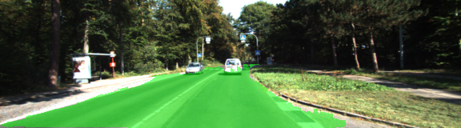

# Semantic Segmentation
### Introduction
In this project, you'll label the pixels of a road in images using a Fully Convolutional Network (FCN).

The idea of FCN was first proposed in a paper titled "Fully Convolutional Networks for Semantic Segmentation"
by Berkeley Vision Lab. Here is a [link to the paper](https://people.eecs.berkeley.edu/~jonlong/long_shelhamer_fcn.pdf). 

### Implementation
Full implementation of the FCN is contained in a single file `main.py` while `helper.py` and `project_tests.py` 
provides some helper functions such as test utils and batch generator. 


The hardest part to understand and implement FCN is to build the skip layers. Even though Tensorflow already
provides a handy functions tf.layers.conv2d_transpose(), it took me a while to figure out what values
each parameter will take. 

### Training
The training was done on Amazon's AWS with a g3-x4large instance (Nvidia Tesla M60 with 8GB memory). Batch size was
set to 12 to provide reasonable speed and avoid running of memory. And the training epoch was set to 30 as it produced
reasonable results.

Here are two images from running the inference through the trained FCN.




### Setup
##### Frameworks and Packages
Make sure you have the following is installed:
 - [Python 3](https://www.python.org/)
 - [TensorFlow](https://www.tensorflow.org/)
 - [NumPy](http://www.numpy.org/)
 - [SciPy](https://www.scipy.org/)
##### Dataset
Download the [Kitti Road dataset](http://www.cvlibs.net/datasets/kitti/eval_road.php) from [here](http://www.cvlibs.net/download.php?file=data_road.zip).  Extract the dataset in the `data` folder.  This will create the folder `data_road` with all the training a test images.

### Start

##### Run

Run the following command to get pretrianed VGG model and training data for the project:
```
setup_data.sh
```

Run the following command to run the project:
```
python main.py
```
**Note** If running this in Jupyter Notebook system messages, such as those regarding test status, may appear in the terminal rather than the notebook.

### Submission
1. Ensure you've passed all the unit tests.
2. Ensure you pass all points on [the rubric](https://review.udacity.com/#!/rubrics/989/view).
3. Submit the following in a zip file.
 - `helper.py`
 - `main.py`
 - `project_tests.py`
 - Newest inference images from `runs` folder  (**all images from the most recent run**)
 
 ## How to write a README
A well written README file can enhance your project and portfolio.  Develop your abilities to create professional README files by completing [this free course](https://www.udacity.com/course/writing-readmes--ud777).
